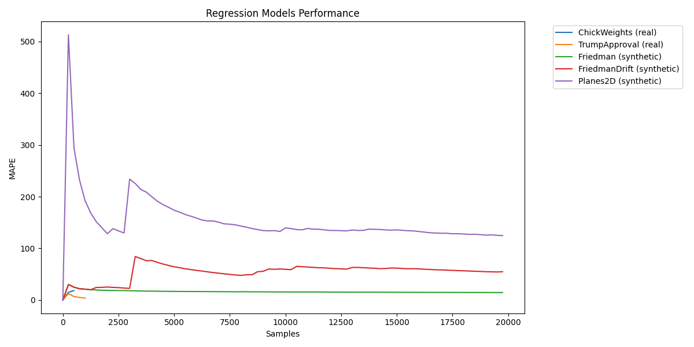
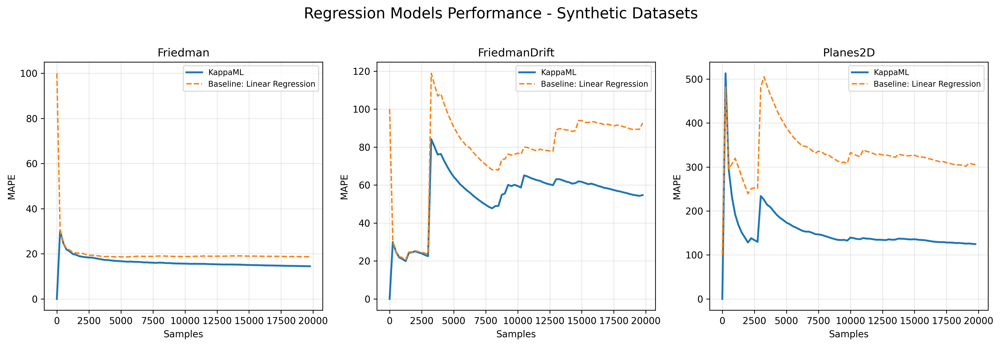
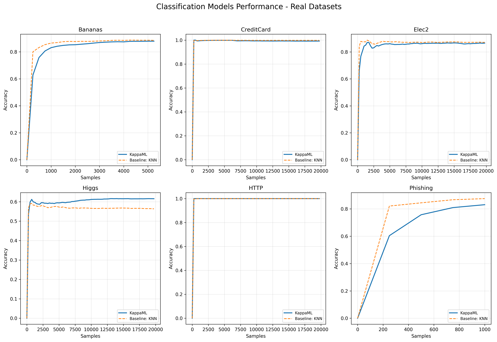
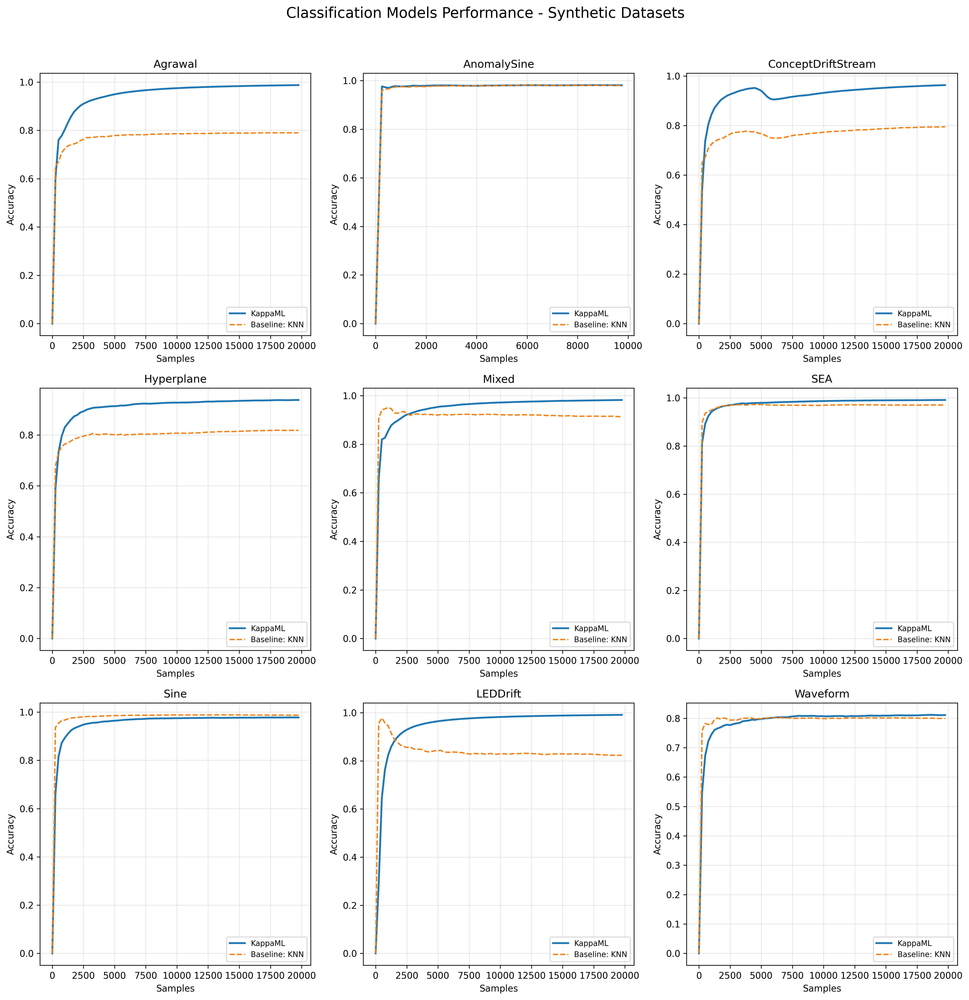

# KappaML Benchmarks

This repository contains the code for running benchmarks for the [KappaML](https://kappaml.com) platform.

Platform: https://kappaml.com
API Keys: https://app.kappaml.com/api-keys
API Documentation: https://api.kappaml.com/docs
OpenAPI Schema: https://api.kappaml.com/openapi.json


## Running the benchmarks

### Installation

```bash
pip install -r requirements.txt
```

### Running the benchmarks

Get an API key from https://app.kappaml.com/api-keys and set as env variable

```bash
export KAPPAML_API_KEY="your_api_key_here"
```

Run the benchmarks
```bash
python run_benchmarks.py
```

### Plotting the results

```bash
python plot_results.py
```

## Results

The results are saved in the `results` directory.

### Results Table

The results are saved in the `results/results.md` file.

### Figures

The figures are saved in the `figures` directory and individual model results as well as aggregated results.

### Regression Models





### Classification Models  





