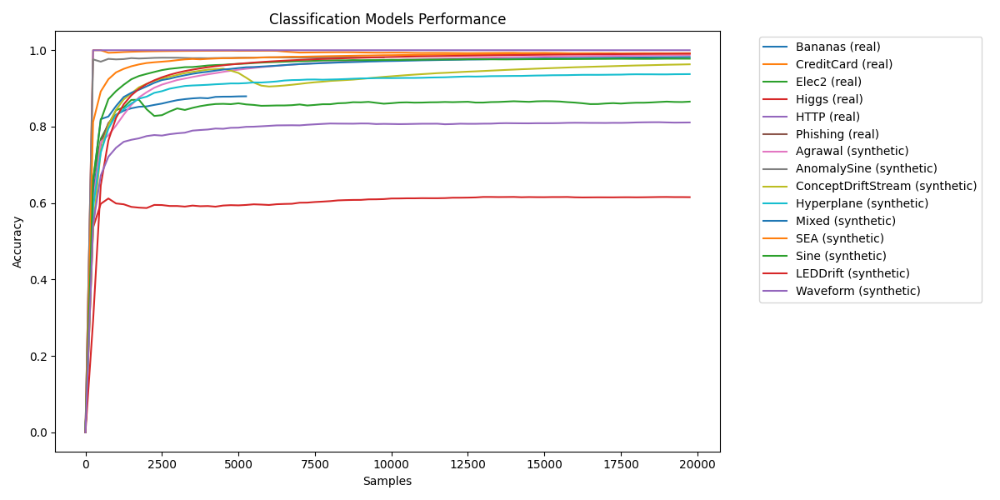

# KappaML Benchmarks

This repository contains the code for running benchmarks on KappaML models.

## Running the benchmarks

### Installation

```bash
pip install -r requirements.txt
```

### Running the benchmarks

```bash
python run_benchmarks.py
```

### Plotting the results

```bash
python plot_results.py
```

## Results

The results are saved in the `results` directory.

### Results Table

The results are saved in the `results/results.md` file.

### Figures

The figures are saved in the `figures` directory and individual model results as well as aggregated results.

### Regression Models


### Classification Models  



